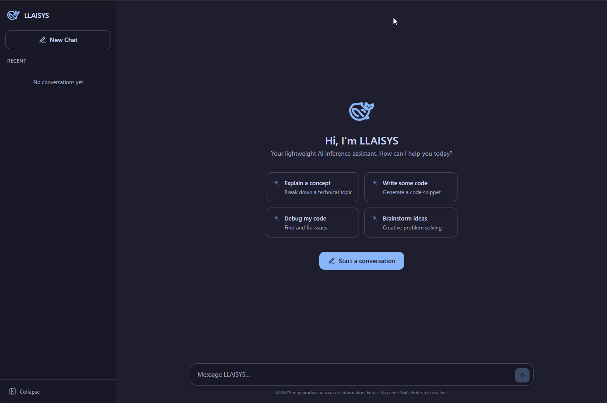

# Welcome to LLAISYS

<p align="center">
<a href="CHEATSHEET.md" target="CHEATSHEET.md">Cheat sheet</a> ｜
<a href="docs/README.md" target="docs/README.md">Origin Markdown</a>
</p>

<p align="center">

</p>

## Introduction

LLAISYS (Let's Learn AI SYStem) is an educational project that aims to provide a platform for new and future AI
engineers to learn how to build AI systems from scratch. LLAISYS consists of several assignments, which help students
learn and build the basic modules, and projects that challenge them to add more fancy features to their systems. LLAISYS
uses C++ as primary programming language for system backend, and is compiled into shared libraries exposing C language
APIs. Frontend codes are written in Python which calls these APIs to provide more convenient testing and interaction
with other architectures such as PyTorch.

## Prerequisites

- Compile Tool [Xmake](https://xmake.io/)
- Package manger [vcpkg](https://github.com/microsoft/vcpkg.git)
    - git clone https://github.com/microsoft/vcpkg.git
      cd vcpkg
      ./bootstrap-vcpkg.sh

      ```bash
      #~/.bashrc
      export PATH="$PATH:/path/to/vcpkg"
      export VCPKG_ROOT=""/path/to/vcpkg"
      ```
- C++ Compiler: MSVC (Windows) or Clang or GCC
- CUDA Toolkit (Optional): [CUDA Toolkit](https://developer.nvidia.com/cuda-downloads)
- Python >= 3.9 (PyTorch, Transformers, etc.)
- Clang-Format-16 (Optional): for formatting C++ codes.
- Nodejs [nodejs v22.13.0](https://nodejs.org/dist/v22.13.0/)

## Setup

- Git clone and cd into the project directory
- Install vcpkg packages at the project root directory and it would generate a vcpkg_installed directory.
  ```bash
  vcpkg install
  ```
- Generate JSON Compilation Database for the IDE and static analysis:
  ```
  xmake project -k compile_commands
  ```
- Setup py lib and infer service venv of symlink and frontend node_modules:
  ```bash
  # These tasks will setup python virtual environment and install python dependencies for each sub module.
  # And install node_modules for frontend.
  # You can direct run these commands if you don't want to use xmake target.
  xmake build pylib
  xmake build infer-service
  xmake build portal-ui
  ```
- Config project and its toolchain:
    - For devices w/o CUDA support,
      ```bash
      xmake f -m release --nv-gpu=n --mkl=y
      ```
    - For devices of CUDA support,
      ```bash
      xmake f -m release --nv-gpu=y --mkl=y
      ```
    - [Optional] You can also config the project with a menu interface:
      ```bash
      xmake f --menu
      ```
        - You can select different options for MKL, CUDA, and toolchain.
        - For example, if you want to enable MKL and use clang, you can select:
            - mkl: y
            - toolchain: clang
    - After configuration, you can check the current configuration with:
        ```bash
        xmake f -v
        ```
- Build and install and it would copy the shared object to the python/llaisys/libllaisys/:
  ```bash
  xmake
  xmake install
  ```
- Pull the Qwen model to your workspace:
  ```bash
  # Install hf if needed
  pip install -U "huggingface_hub[cli]"

  # Download the model to the models/DeepSeek-R1-Distill-Qwen-1.5B foldr
  hf download deepseek-ai/DeepSeek-R1-Distill-Qwen-1.5B --local-dir ./models/DeepSeek-R1-Distill-Qwen-1.5B
  ```
- Start the infer service:
  ```bash
  # Set the env INFER_DEVICE=nvidia if you want to use cuda
  # I am using NVIDIA RTX A500 Laptop GPU of 4GB memory, and it could barely fit the model in BFloat16.
  cd.
  python.exe -m uvicorn infer.main:app 
  ```
- [Optional] Build test-cuda executable to debug with cuda-gdb
  ```bash
  xmake build test-cuda
  ```
- [Optional] Benchmark the linear kernel comparing with the pytorch:
     ```bash
     # for cpu only
     python test/ops/linear.py --device cpu --profile
    # for cuda
    python test/ops/argmax.py --device nvidia --profile
     ```
    ```
    python test/ops/argmax.py --device nvidia --profile
    Testing Ops.argmax on nvidia
    shape (4,) dtype <f32>
    Torch time: 0.01349 ms
    LLAISYS time: 0.01297 ms
    shape (4,) dtype <f16>
    Torch time: 0.00973 ms
    LLAISYS time: 0.00905 ms
    shape (4,) dtype <bf16>
    Torch time: 0.01045 ms
    LLAISYS time: 0.00918 ms
    shape (4096,) dtype <f32>
    Torch time: 0.00954 ms
    LLAISYS time: 0.00865 ms
    shape (4096,) dtype <f16>
    Torch time: 0.01071 ms
    LLAISYS time: 0.01052 ms
    shape (4096,) dtype <bf16>
    Torch time: 0.00932 ms
    LLAISYS time: 0.01745 ms
    shape (1048576,) dtype <f32>
    Torch time: 0.05229 ms
    LLAISYS time: 0.04972 ms
    shape (1048576,) dtype <f16>
    Torch time: 0.03143 ms
    LLAISYS time: 0.02898 ms
    shape (1048576,) dtype <bf16>
    Torch time: 0.03204 ms
    LLAISYS time: 0.03048 ms
    shape (2097152,) dtype <f32>
    Torch time: 0.09603 ms
    LLAISYS time: 0.09374 ms
    shape (2097152,) dtype <f16>
    Torch time: 0.05344 ms
    LLAISYS time: 0.05146 ms
    shape (2097152,) dtype <bf16>
    Torch time: 0.05375 ms
    LLAISYS time: 0.05316 ms
    Test passed!
    ```
- [Optional] Benchmark the infer service comparing with the pytorch:
    ```bash    
    # for cpu only    
    python test/test_infer.py --device cpu --model ./models/DeepSeek-R1-Distill-Qwen-1.5B    
    # for cuda    
    python test/test_infer.py --device nvidia --model ./models/DeepSeek-R1-Distill-Qwen-1.5B    
     ```
    ```
    Loading model from local path: ./models/DeepSeek-R1-Distill-Qwen-1.5B
    
    Loading weights:
    100%|█████████████████████████████████████████████████████████████████████████████████████████████████████████████████████████████████████████████████████████████████████████████████████████████████████████████████████|
    339/339 [00:07<00:00, 45.26it/s, Materializing param=model.norm.weight]
    The attention mask and the pad token id were not set. As a consequence, you may observe unexpected behavior. Please pass
    your input's `attention_mask` to obtain reliable results.
    Setting `pad_token_id` to `eos_token_id`:151643 for open-end generation.
    The attention mask is not set and cannot be inferred from input because pad token is same as eos token. As a
    consequence, you may observe unexpected behavior. Please pass your input's `attention_mask` to obtain reliable results.
    
    === Answer ===
    
    Tokens:
    [151646, 151644, 15191, 525, 498, 30, 151645, 151648, 198, 91786, 0, 358, 2776, 18183, 39350, 10911, 16, 11, 458, 20443, 11229, 17847, 3465, 553, 18183, 39350, 13, 358, 2776, 518, 697, 2473, 323, 1035, 387, 33972, 311, 7789, 498, 448, 894, 43883, 476, 9079, 498, 1231, 614, 624, 151649, 271, 91786, 0, 358, 2776, 18183, 39350, 10911, 16, 11, 458, 20443, 11229, 17847, 3465, 553, 18183, 39350, 13, 358, 2776, 518, 697, 2473, 323, 1035, 387, 33972, 311, 7789, 498, 448, 894, 43883, 476, 9079, 498, 1231, 614, 13, 151643]
    
    Contents:
    <｜User｜>Who are you?<｜Assistant｜><think>
    Greetings! I'm DeepSeek-R1, an artificial intelligence assistant created by DeepSeek. I'm at your service and would be
    delighted to assist you with any inquiries or tasks you may have.
    </think>
    
    Greetings! I'm DeepSeek-R1, an artificial intelligence assistant created by DeepSeek. I'm at your service and would be
    delighted to assist you with any inquiries or tasks you may have.
    
    Time elapsed: 5.13s
    
    [infer] Starting inference. Max steps: 128
    [Debug] Vocab Size: 151936
    [infer] Stop token reached (token=151643).
    
    === Your Result ===
    
    Tokens:
    [151646, 151644, 15191, 525, 498, 30, 151645, 151648, 198, 91786, 0, 358, 2776, 18183, 39350, 10911, 16, 11, 458, 20443, 11229, 17847, 3465, 553, 18183, 39350, 13, 358, 2776, 518, 697, 2473, 323, 1035, 387, 33972, 311, 7789, 498, 448, 894, 43883, 476, 9079, 498, 1231, 614, 624, 151649, 271, 91786, 0, 358, 2776, 18183, 39350, 10911, 16, 11, 458, 20443, 11229, 17847, 3465, 553, 18183, 39350, 13, 358, 2776, 518, 697, 2473, 323, 1035, 387, 33972, 311, 7789, 498, 448, 894, 43883, 476, 9079, 498, 1231, 614, 13, 151643]
    
    Contents:
    <｜User｜>Who are you?<｜Assistant｜><think>
    Greetings! I'm DeepSeek-R1, an artificial intelligence assistant created by DeepSeek. I'm at your service and would be
    delighted to assist you with any inquiries or tasks you may have.
    </think>
    
    Greetings! I'm DeepSeek-R1, an artificial intelligence assistant created by DeepSeek. I'm at your service and would be
    delighted to assist you with any inquiries or tasks you may have.
    
    Time elapsed: 3.28s
    ```

## Keypoints

### Tensor & Core Infrastructure

- Implemented tensor class with `view`, `permute`, `slice`, `load`, and contiguity checks, supporting shared storage and
  arbitrary strides
- Built a device-agnostic runtime abstraction via function-pointer tables (`LlaisysRuntimeAPI`), enabling the same
  codebase to target CPU and NVIDIA GPUs
- Implemented a best-fit caching allocator (analogous to PyTorch's CUDA caching allocator) that pools freed blocks and
  reuses them via `lower_bound` lookup, avoiding repeated device malloc/free overhead

### CPU Operators & Optimization

- Implemented all 8 operators (argmax, embedding, linear, rms_norm, rope, self_attention, swiglu, rearrange) with
  F32/F16/BF16 support
- Integrated OpenMP for multi-threaded parallelism and SIMD hints (`OMP_SIMD`) across operators
- Integrated Intel MKL (`cblas_sgemm`, `cblas_hgemm`, `cblas_gemm_bf16bf16f32`) and OpenBLAS for accelerated GEMM, with
  fallback to a cache-blocked OpenMP GEMM (32×64×256 blocks) when MKL is unavailable
- Cross-platform support — handled MSVC's lack of `collapse(2)` in OpenMP with flattened parallel-for workarounds

### CUDA Operators

- Ported all operators to CUDA with custom kernels for element-wise and reduction operations
- **Argmax**: hierarchical reduction (warp-level `__shfl_down_sync` → shared memory → cross-block) with a single-pass
  multi-block strategy using `__threadfence()` + `atomicInc` last-block pattern — avoids a second kernel launch for
  large inputs
- **Linear**: used cuBLASLt with a plan cache keyed by `(M, K, N, dtype, has_bias)` to eliminate setup overhead for the
  197 repeating GEMM shapes (7 linears × 28 layers + logits), plus fused bias epilogue via `CUBLASLT_EPILOGUE_BIAS`
- **Self-Attention**: dual-path — cuBLAS batched GEMM with custom causal-softmax kernel for large heads, and a fused
  online-softmax kernel (running max + running sum without materializing the score matrix) for small sizes. GQA handled
  via stride broadcasting
- **Sample**: Temperature/Top-K/Top-P (nucleus) sampling with CUB `DeviceRadixSort::SortPairsDescending` (O(N) radix
  sort with pre-allocated temp storage), on-device softmax with zero host syncs, and minimal D2H transfer. Benchmarks
  beat PyTorch across all configurations on 151K vocab

### Model Inference

- Implemented Qwen2 (DeepSeek-R1-Distill-Qwen-1.5B) end-to-end in C++ with KV cache, achieving identical output to
  PyTorch's HuggingFace reference at 1.6× faster wall time (3.28s vs 5.13s)
- Greedy path uses dedicated argmax kernel; stochastic path uses the full sample op pipeline

### Inference Service

- Built a FastAPI server with OpenAI-compatible `POST /v1/chat/completions` endpoint supporting both streaming (SSE with
  token-by-token delivery) and non-streaming modes
- Implemented a KV cache pool with prefix matching — slot acquisition prioritizes longest prefix match, then empty
  slots, then LRU eviction. Only one KV cache lives on device at a time (swap in/out)
- Streaming uses `asyncio.to_thread()` for the blocking C backend with `loop.call_soon_threadsafe()` for real-time token
  delivery
- Conversation lifecycle management with `POST/DELETE /v1/conversations` endpoints for KV cache cleanup

### Chat UI (React + TypeScript)

- Built a React SPA with Vite, featuring a sidebar for conversation management (create, rename, delete), real-time
  streaming display via `appendToken`, and localStorage persistence
- Integrated with the inference server's SSE streaming for live token-by-token rendering

### Build System

- Structured xmake build with modular `.lua` configs per device (`cpu.lua`, `nvidia.lua`), automatic venv/symlink
  setup (`pylib.lua`, `infer.lua`), and frontend node_modules management (`portal.lua`)
- Conditional CUDA compilation via `ENABLE_NVIDIA_API` macro, vcpkg integration for C++ dependencies

## Drawbacks

- Kernels process only single sequences — no batched inference across multiple requests in parallel on GPU
- Did not have the devices to develop upon clusters using NCCL/NVLink for multi-GPU or distributed inference
- Self-attention uses custom causal-softmax + cuBLAS GEMM, not FlashAttention — memory and compute efficiency falls
  behind for long sequences
- KV cache pool swaps entire states between host and device — no paged/block-level KV management (e.g. vLLM-style
  PagedAttention)
- No tensor parallelism or pipeline parallelism — the model runs on a single device
- No quantization support (e.g. INT8/INT4/GPTQ/AWQ) — model must fit in full BF16, limiting deployment to GPUs with
  enough memory
- No speculative decoding or other latency-reduction techniques for autoregressive generation
- No continuous batching — the server processes one request at a time, blocking subsequent requests